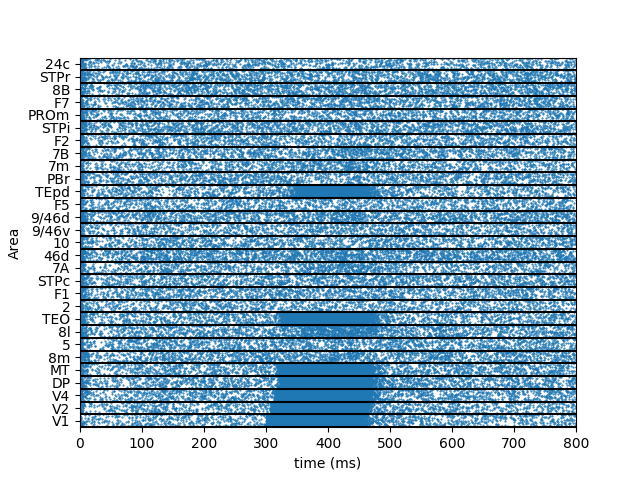
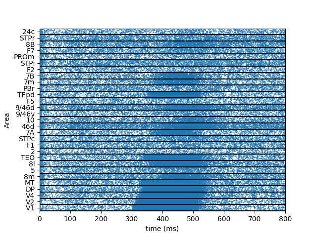
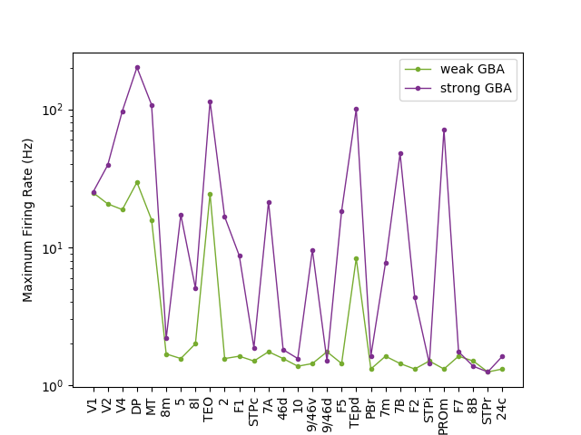

### Brian codes

python figures.py arg1 arg2 arg3 arg4 arg5

    arg1: number of areas ( input : a integer value less than 30 )

    arg2: figure ( input : '5B', '5C', '5E', '6A, '6B', '6D')

    arg3: save data (input: 'yes' or 'no')

    arg4: save figure (input: 'yes' or 'no')

    arg5: use saved data to generate figure (input: 'yes' or 'no')	

Files and figures will be saved in folder files and figures, respectively.

#### Examples,

python figures.py 29 5B yes yes

python figures.py 29 5C yes yes

python figures.py 29 5E yes yes

python figures.py 29 6A yes yes

python figures.py 29 6B yes yes

python figures.py 29 6D yes yes

