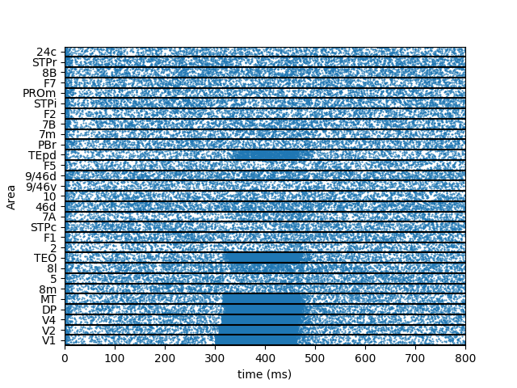
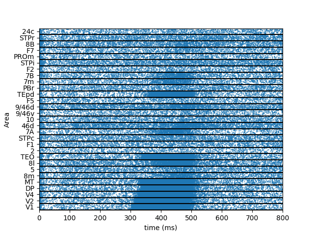
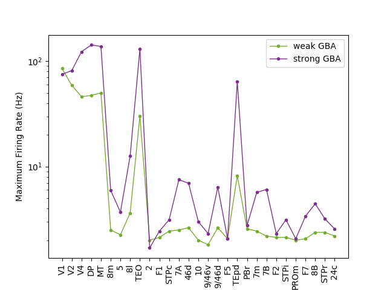
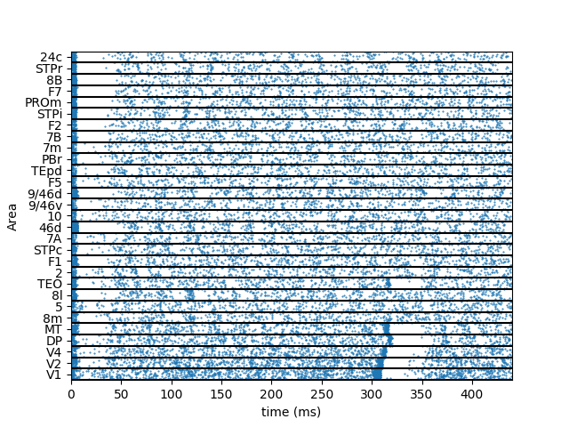
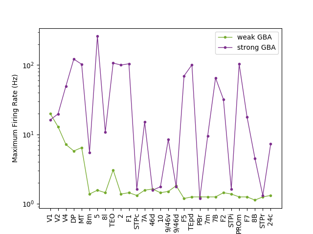

#### PyNN version

### work in progress ...

python figuresPyNN.py arg1 arg2 arg3 arg4 arg5 arg6

    arg1: number of areas ( input : a integer value less than 30 )

    arg2: figure ( input : '5B', '5C', '5E', '6A, '6B', '6D')
	
    arg3: simulator (input: '-neuron' or '-nest')
	
    arg4: save data (input: 'yes' or 'no')

    arg5: save figure (input: 'yes' or 'no')

    arg6: use saved data to generate figure (input: 'yes' or 'no')	

Files and figures will be saved in folders files and figures, respectively.

Examples:

python figuresPyNN.py 29 5B -neuron yes yes no

python figuresPyNN.py 29 5C -neuron yes yes no

python figuresPyNN.py 29 5E -neuron yes yes yes

python figuresPyNN.py 29 6A -neuron yes yes no

python figuresPyNN.py 29 6B -neuron yes yes no

python figuresPyNN.py 29 6D -neuron yes yes yes

